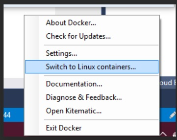

# Install Pre-requisites

* Install WSL2 on windows 11
https://docs.microsoft.com/en-us/windows/wsl/install

* Install docker desktop
https://hub.docker.com/editions/community/docker-ce-desktop-windows

Verify docker desktop is running with "Linux container" mode



Open command prompt/powershell

clone the repo wih the branch e2e-demo

```
git clone https://github.com/Azure/azureml-examples.git -b banide/e2e-demo
```


Go inside this folder and run docker build on [this docker file](dockerbuild\sdk_test_ubuntu.dockerfile)


```
cd azureml-examples/notebooks/demo/dockerbuild
docker build --pull --rm -f "sdk_test_ubuntu.dockerfile" -t sdkv2-samples:latest "." 
```

Start the docker container
```
docker run --name sample_container --rm -p 8888:8888 -it sdkv2-samples:latest
```

Run this command in the container:

```
bash .start_jupyter.sh
```
Open browser on : [http://localhost:8888/lab](http://localhost:8888/lab)