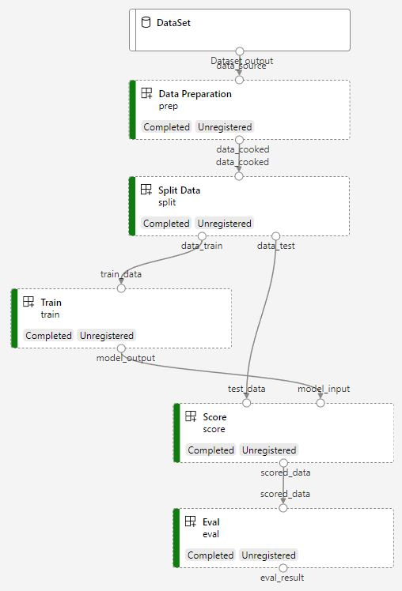

# How to start building AML pipeline from template project
An Azure Machine Learning pipeline is an independently executable workflow of a complete machine learning task. To help user start using AML pipeline, AML provides set of pipeline template to help users build basic pipelines from scratch or coverting their existing training script to pipeline. 
- New to machine learning pipeline
- Want to learn how to build AML pipeline
- Have a simple training script and want to translate it to AML pipeline.
## Prerequisite 
- Benifits for using pipeline
- Basic concept of AML pipeline 

## Pipeline sample template list
| template | Sample data | Goal | Algo & framework | Preference | Step count | Flow example
|:--- |:--- |:--- |:--- |:--- |:--- |:--- |
| Simple training pipeline | Public NYC taxi data | Predict cost of taxi in NYC | Gradient Boosting regression from Scikit Learn | Python SDK | 5 |  |
| Simple batch inference pipeline | TBD | TBD | TBD | TBD | TBD | TBD |
| Hyper-parameter tuning pipeline | TBD | TBD | TBD | TBD | TBD | TBD |
| Distributed GPU training pipeline | TBD | TBD | TBD | TBD | TBD | TBD |
